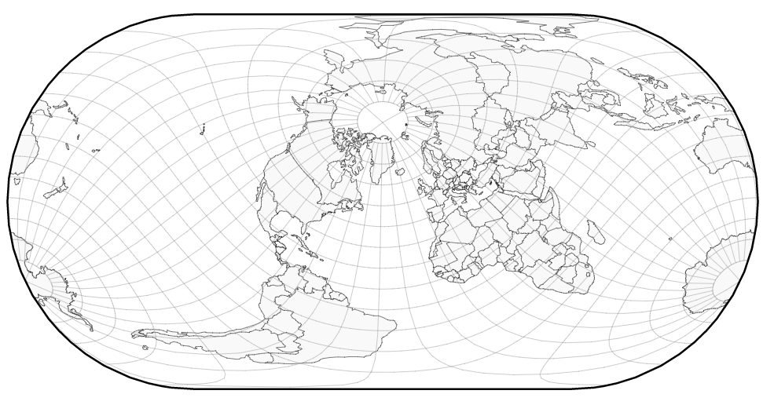
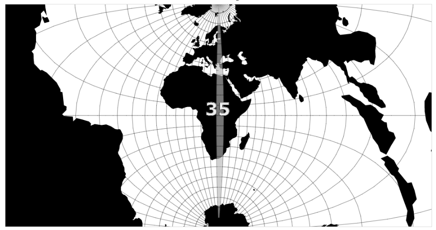

# Kartprojeksjoner og koordinater: Hvorfor ligger dataene mine feil i kartet?

Når man jobber med kart blir man raskt klar over at stedfestede data ikke kommer i ett format eller i en form. Er man ikke nøyaktig med dataene kan punktet, linja eller flaten du jobber med havne på et helt annet sted i kartet enn det som var tiltenkt. Å bruke norske data som er tilpasset til bruk i norske kart kan by på utfordringer i implementasjoner med APIer med et globalt fokus. De beste kartdataene for Norge kan du laste ned gratis fra Kartverket, og for å kunne bruke disse må projeksjonen som kartet ditt bruker matche dataene. Hvorfor er det slik? Og hva kan du gjøre for at dine geometrier havner på rett plass? Denne artikkelen tar for seg utfordringer utviklere ofte møter i kartapplikasjoner, hvordan man behandler data i ulike projeksjoner, og hvordan du kan løse de.

## Hvorfor har vi så mange kartprojeksjoner?

Det finnes uendelige antall kartprojeksjoner. Ta en titt [her](http://bl.ocks.org/mbostock/3711652) for å se en håndfull projeksjoner illustrert med [d3](https://github.com/mbostock/d3). Hvorfor er det slik?

Jordas form er en sammentrykt kule og kan sammenlignes med formen til en appelsin. For å lage et kart i to dimensjoner av denne tredimensjonale figuren må vi "skrelle" appelsinen og strekke den flat. Denne strekkingen forvrenger appelsinskallet og kartet det representerer. Kartprojeksjoner handler om hvordan vi velger å strekke kartet, og hvilke egenskaper vi ønsker å beholde fra den opprinnelige formen. Noen kart har korrekte vinkler og egner seg til bruk i navigasjon, mens andre er slik at arealet bevares. Visste du at Afrika er fjorten ganger større enn Grønland? Den mest vanlige projeksjonen "Mercator" bevarer ikke areal og forvrenger kartet slik at Grønland ser ut til å ha samme størrelse som Afrika. I denne projeksjonen forvrenges kartet mer jo lengre fra ekvator man kommer. 

Siden Norge ligger ganske langt nord vil kartet få en ganske stor forvrenging i denne mercatorprojeksjonen. For å få bukt på dette problemet finnes det projeksjoner som forvrenger lite i et bestemte områder. Norske kart blir derfor ofte lagret i en projeksjon som forvrenger kartet lite i Norge. Norges offisielle projeksjon heter "Universal Transversal Mercator" (UTM) og finnes i flere soner tilpasset ulike deler av landet. UTM sone 32 anbefales brukt for Sør-Norge til og med Nord-Trøndelag, sone 33 brukes i Nordland og Troms, mens sone 35 brukes for Finnmark. Kartverkets nasjonale datasett gis ut i UTM sone 33 da dette er en god middelvei for hele landet.

[@turban](https://github.com/turban) har laget en flott illustrasjon som viser sammenhengen mellom UTM-soner og hvordan de forvrenger kartet forskjellig. Denne kan du se [her](http://bl.ocks.org/turban/5866872). Illustrasjonen viser også hvor grensene for de 60 UTM-sonene går, men vær oppmerksom på at den ikke viser grensene rundt Norge og Svalbard korrekt da det her finnes unntak fra den generelle regelen.

## Slik bruker APIene projeksjoner

Kartbiblioteker som Leaflet, OpenLayers, ArcGIS for JavaScript og Google Maps API bruker "Web Mercator" som standard kartprojeksjon. Kartprojeksjonene eller koordinatsystemet som disse APIene bruker blir spesifisert med en unik kode som kalles SRID (Spatial Reference Identifier) som oftest er en standardisert kode fra EPSG (European Petroleum Survey Group). Web Mercator identifiseres med "EPSG:3857", men kan også finnes som "900913" (Google stavet med tall!) eller "ESRI:102113". Denne projeksjonen antar at jorda er en sfære og gir store forvrengninger i nordområdene. Derfor tegnes ofte kart for Norge i en mer egnet projeksjon, som nevnt tidligere. Disse kartene har også slike koder og representeres av henholdsvis "EPSG:25832", "EPSG:25833" og "EPSG:25835" for UTM sone 32, 33 og 35.

For å kunne tegne kartet i en bestemt projeksjon må bakgrunnskartet du bruker være i den projeksjonen du har valgt. Det finnes mange bakgrunnskart fritt tilgjengelig i "Web Mercator" (3857) som kan brukes sammen med de store kartbibliotekene. Norske bakgrunnskart kan du finne gratis fra Kartverket, eller fra norske leverandører.

Leaflet støtter ikke andre projeksjoner enn "EPSG:3857", men ved hjelp av et tilleggsbibliotek [Proj4Leaflet](https://github.com/kartena/Proj4Leaflet) kan man definere flere. OpenLayers inkluderer [Proj4js](https://github.com/proj4js/proj4js) som lar deg tegne kartet i en fritt definert projeksjon. ArcGIS for JavaScript støtter alle vanlige projeksjoner.

## Koordinatsystem
Vi har sett på hvordan kartet tegnes ved hjelp av projeksjoner. Nå skal vi se på hvilke koordinatsystem som er oftest brukt, og hvordan man får geometri til å havne på rett plass i kartet. Et koordinatsystem bestemmer hvordan man identifiserer et punkt på jorda.

Man kan dele inn koordinatsystemene oftest brukt i to kategorier:

1.	Geografiske koordinatsystem
2.	Projiserte koordinatsystem

Et geografisk koordinatsystem tar utgangspunkt i et sfærisk element som for eksempel en kule, og beskriver et punkt på overflaten til denne. Det mest kjente eksempelet her er lengde og breddegrad. Breddegrad er antall grader fra ekvator, og lengdegrad måles i antall grader fra nullmeridianen (utgangspunktet) som er definert i Greenwich, London. Oslo Sentrum vi ha koordinatene "59.91192223, 10.7336" i "EPSG:4326"/WGS84. Det er gjerne på denne formen kartbiblioteker ønsker at man oppgir geometri på. Men siden kartet tegnes i "EPSG:3857" blir koordinatene projisert internt før de blir tegnet i kartet.

Et projisert koordinatsystem gir posisjonen til et punkt på en flat overflate. Samme posisjon i Oslo Sentrum i det projiserte koordinatsystemet "EPSG:25832"/UTM sone 32 vil være "596945.749, 6642871.404" Koordinatene viser avstanden fra et definert nullpunkt i henholdsvis østlig og nordlig retning.

## Hvordan bruker vi data og kart med forskjellige projeksjoner sammen?

Men hvordan skal vi bruke data i en annen kartprojeksjon sammen med kartbiblioteker som bruker "Web Mercator"? Da har vi to muligheter:

1.  Reprojesere bakgrunnskartet brukt av biblioteket til å matche dataene.
2.  Reprojesere dataene til "Web Mercator".

## Nyttige tips

*
*
*

Skrevet for http://www.geoforum.no/om-geforum/prosjekt-innovasjon/

**ARTIKKELEN ER UNDER UTARBEIDELSE**
